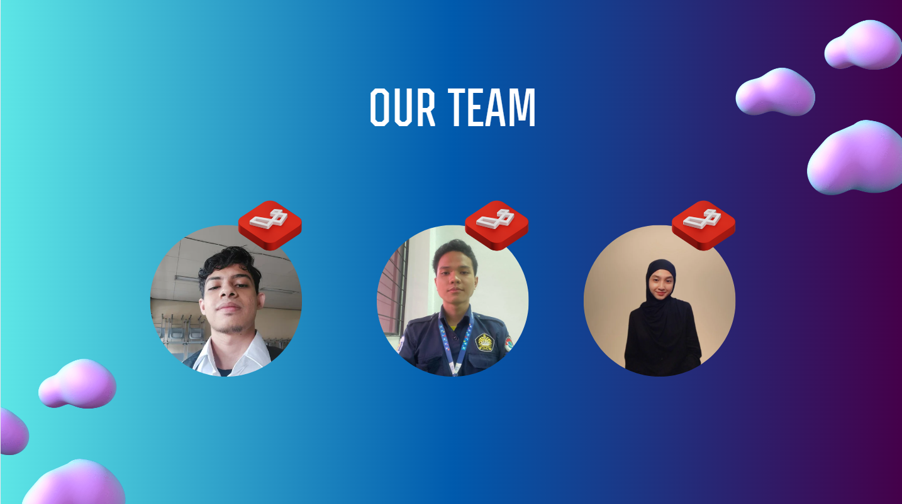
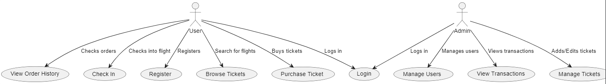
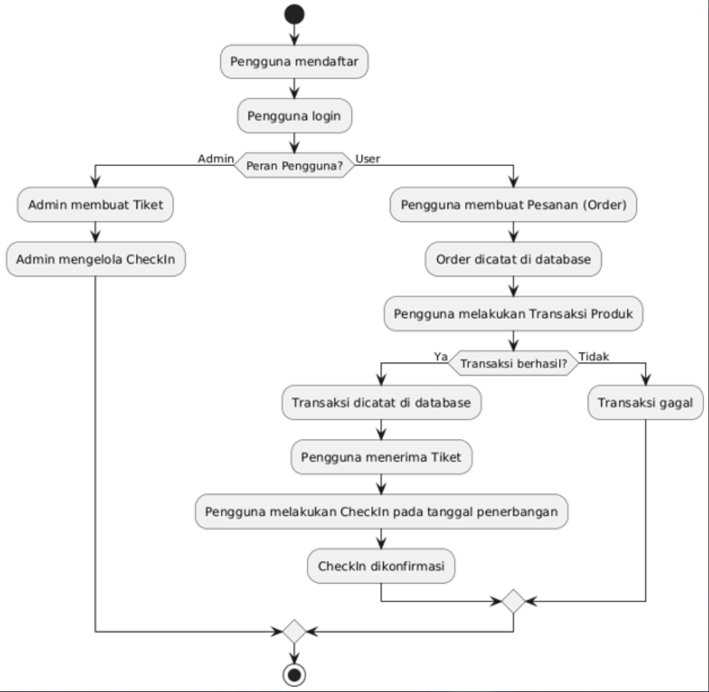
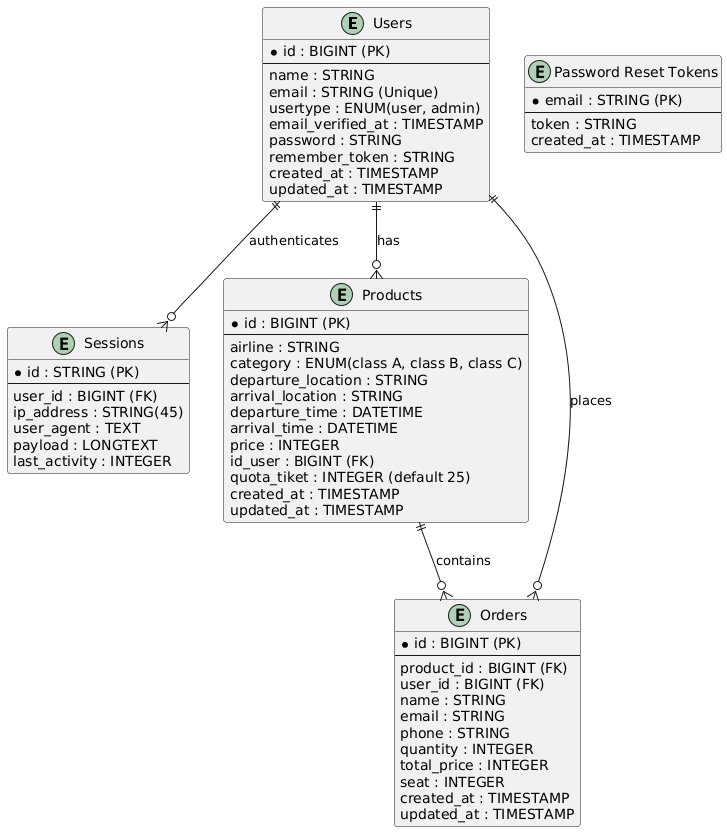

<p align="center"><a href="https://laravel.com" target="_blank"></a></p>

<p align="center">
<a href="https://github.com/laravel/framework/actions"></a>
<a href="https://packagist.org/packages/laravel/framework"></a>
<a href="https://packagist.org/packages/laravel/framework"></a>
<a href="https://packagist.org/packages/laravel/framework"></a>
</p>

<div align="center">
    
</div>


# ✈️ PENJUALAN TIKET PESAWAT - KELOMPOK 1

## Tentang Proyek
Proyek ini adalah Tugas Besar untuk mata kuliah **Pemrograman Berbasis Web** yang menggunakan framework **Laravel 11**. Proyek ini mengimplementasikan sistem **Penjualan Tiket Pesawat** dengan fitur-fitur yang mencakup pemesanan tiket, pengelolaan penerbangan, dan integrasi tampilan frontend yang responsif.

## Anggota Kelompok

| Avatar              | Nama                     | NIM          | Peran               |
|---------------------|--------------------------|--------------|---------------------|
|        | **Husein Zidan**         | 4522210012   | Arsitek Software    |
|        | **Zahra Jane Arnecia**   | 4522210028   | Frontend Engineer   |
|        | **Faathir Akbar Nugroho**| 4522210033   | Backend Engineer    |

## Fitur Admin

- Register : digunakan untuk membuat akun
- login/logut : digunkan untuk mengakses & logut aplikasi web capsswing
- Create : digunakan untuk upload,edit,hapus tiket) 
- Pesanan Pelanggan : digunakan untuk melihat pesanan tiket pelanggan
- Transaksi : digunkaan untuk konfirmasi pesanan pelanggan (konfirmasi  pesanan selesai)
 = Riwayat Penjualan : digunakan untuk melihat Riwayat penjualan

## Fitur Konsumen

- Register : Digunakan untuk membuat akun
- login/logut : Digunkan untuk mengakses & logut aplikasi web capsswing
- Beli Tiket : Dapat digunakan untuk sebagai laman pembeian tiket Ekonomi, business class
- Jadwal Penerbangan : Digunakan untuk melihat jadwal penerbangan pelanggan
- Transaksi : Digunakan untuk proses transaksi/pembayaran
- Riwayat Pembelian : Digunakan untuk melihat Riwayat pembelian


## Use Case


## Flowchart


## ERD


## UI/UX 
- **Tool** : Figma<br>
- **Prototype Device** : MacBook Pro 14"<br>
- **Link** : [klik disini](https://www.figma.com/design/ustWs4I7H3eeqraP37St4h/Project-Capsswing?node-id=0-1&t=c9yuLyyExLy1YR3T-1)
## Teknologi yang Digunakan

- **Backend** : Laravel 11
- **Frontend** : Tailwind & JavaScript
- **Database** : MySQL
- **Version Control** : Git

## Instalasi

1. Clone repository ini:
   ```bash
   git clone https://github.com/Faathir81/SI-Penjualan-Tiket-Pesawat.git
